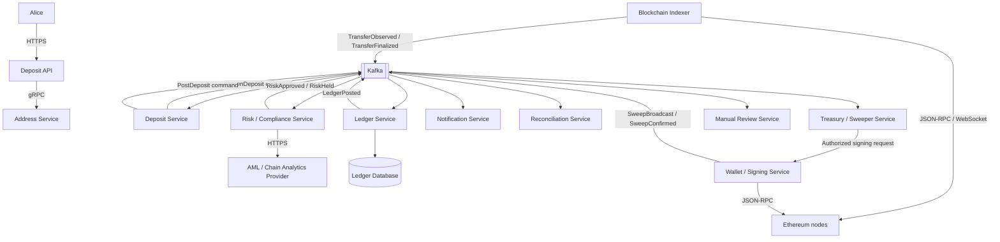
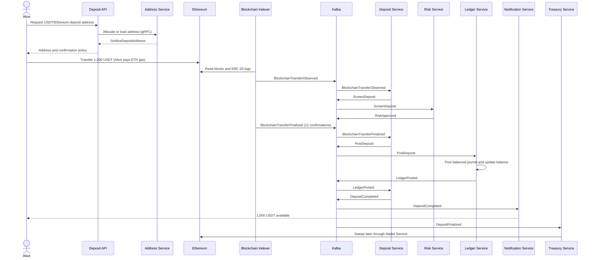
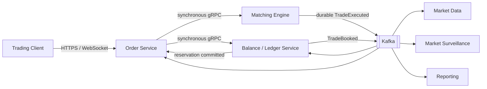

# Praxis CEX ledger

Praxis is a reference implementation of CEX deposit, ledger, and spot
order-admission workflows, based on systems and operational patterns used in
financial-services environments. It provides durable accounting boundaries,
idempotent transaction processing, event-driven integration, and repeatable
performance validation. The repository is not a complete exchange or custody
system.

The repository contains:

- `orderservice`: HTTP order admission, risk simulation, Ledger gRPC, and Matching Engine gRPC.
- `ledgerservice`: PostgreSQL-backed double-entry ledger and reservation APIs.
- `matchingengine`: mock partitioned admission engine that emits `OrderAccepted` to Kafka.
- `outboxrelay`: batched PostgreSQL-outbox-to-Kafka relay.
- `infra/aws`: independent VPC, Amazon MSK, Kafka topics, and Multi-AZ PostgreSQL Terraform.

## Implementation status

| Component | Current scope |
|---|---|
| Ledger Service | Implements deposits, hold releases, order reservations, balance queries, immutable journals/entries, balance projections, and a transactional outbox. |
| Order Service | Implements synchronous risk simulation, Ledger reservation over gRPC, and Matching Engine admission over gRPC. |
| Matching Engine | An order-admission test double that partitions requests in memory and synchronously publishes `OrderAccepted` to Kafka. It does not match orders or emit fills. |
| Outbox Relay | Independently runnable batched relay for publishing PostgreSQL outbox records to Kafka; it is not started by the main Compose file. |
| AWS infrastructure | Terraform reference configuration for an isolated VPC, Amazon MSK, Kafka topics, and Multi-AZ PostgreSQL. Applying it creates billable AWS resources and requires environment-specific review. |
| Deposit architecture | Reference design only; the Address, Indexer, Risk, Treasury, Wallet, Notification, and Reconciliation services are not implemented here. |

## Documentation

- [Ledger Service](ledgerservice/README.md)
- [Order Service and load tests](orderservice/README.md)
- [10,000 requests/s order-admission optimization plan](docs/order-admission-optimization-plan.md)
- [Matching Engine](matchingengine/README.md)
- [Outbox Relay](outboxrelay/README.md)
- [AWS infrastructure](infra/aws/README.md)
- [Microservices migration architecture](docs/microservices-migration.md)
- [Kubernetes one-hour crash course](docs/kubernetes-one-hour-crash-course.md)
- [Deposit and trading reference architecture](#cex-deposit-and-trading-reference-architecture)

For AWS MSK, the Ledger, Matching, and Outbox Relay Kafka clients support
opt-in IAM/TLS with `KAFKA_AUTH_MODE=msk_iam` and `AWS_REGION`. The local
Compose stack remains plaintext by default. See the AWS infrastructure guide
for the scoped MSK policies and the Ledger topic mapping needed at deployment.

## Quick start

Prerequisites are Go, Docker with the Compose plugin, GNU Make, and `curl`.
Start the core local stack from the repository root:

```bash
make compose-up
```

This command stays attached and displays container logs. Use `Ctrl+C` to stop
it, or start the detached stack with live dashboards using
`make observability-up`.

## Local ports

| Host port | Service | Protocol | Purpose |
|---:|---|---|---|
| `8081` | Ledger Service | HTTP | Ledger operations, queries, health, readiness, and metrics |
| `9091` | Ledger Service | gRPC | Synchronous balance reservation and ledger operations |
| `8083` | Order Service | HTTP | Order-admission API, health, readiness, and metrics |
| `8084` | Matching Engine | HTTP | Health and metrics |
| `9090` | Prometheus | HTTP | Live metrics queries and target status |
| `3000` | Grafana | HTTP | CEX load-test dashboard (`admin` / `admin`, local only) |
| `3200` | Tempo | HTTP | Local trace search API |
| `4317` | OpenTelemetry Collector | OTLP/gRPC | Trace ingestion |
| `4318` | OpenTelemetry Collector | OTLP/HTTP | Trace ingestion |
| `9094` | Matching Engine | gRPC | Synchronous `SubmitOrder` from the Order Service |
| `5433` | PostgreSQL | PostgreSQL | Local database access; containers use `postgres:5432` |
| `9093` | Kafka | Kafka | Local broker access; containers use `kafka:9092` |

Start the full local stack with live metrics dashboards:

```bash
make observability-up
```

Prometheus scrapes the application services plus cAdvisor and Node Exporter.
The services export OpenTelemetry traces through the Collector to Tempo.
Grafana provisions the `CEX Load Test` dashboard and Tempo data source
automatically. In Grafana, open **Explore**, select **Tempo**, and use
**Search** to inspect traces by service. See
[`orderservice/README.md`](orderservice/README.md#live-prometheus-and-grafana-dashboard)
for dashboard contents, security scope, and shutdown instructions.

Check the running services with:

```bash
curl http://localhost:8081/healthz
curl http://localhost:8081/readyz
curl http://localhost:8083/healthz
curl http://localhost:8083/readyz
curl http://localhost:8084/healthz
curl http://localhost:8084/readyz
```

Compose creates `ledger-commands`, `ledger-events`, and `matching.events.v1`
before starting the Ledger Service and Matching Engine. This prevents order
admission from failing because a required Kafka topic is missing.

Run all Go tests and static checks:

```bash
make test
make vet
```

The order-admission load-test instructions are in
[`orderservice/README.md`](orderservice/README.md).

Prepare a clean distributed-user test from the repository root:

```bash
make reset-load-data
make seed-distributed-users
```

`seed-distributed-users` creates 10,000 users with 1,000 USDT each by default.
Override the defaults with `USER_COUNT` and `AVAILABLE_ATOMIC` make variables.

## CEX Deposit and Trading Reference Architecture

The remainder of this README describes the production-oriented reference
architecture. It is intentionally broader than the currently runnable scope.
The deposit flow follows Alice depositing 1,000 USDT over Ethereum into a CEX;
network policies and confirmation counts are deployment-specific.

### Accounting result

After the deposit reaches the required finality and passes risk screening, the
ledger records:

```text
DEBIT   CEX Ethereum USDT custody asset       1,000 USDT
CREDIT  Alice available USDT liability        1,000 USDT
```

USDT has six decimals, so the ledger amount is:

```text
1,000 USDT = 1,000,000,000 atomic units
```

Alice pays ETH gas when she submits the ERC-20 transfer. The CEX does not
record Alice's gas payment because Alice's ETH never belongs to the CEX.

### High-level reference architecture



### Services and responsibilities

#### Deposit API

The Deposit API is the user-facing boundary. It:

- Authenticates users and applies rate limits.
- Returns supported assets, networks, and deposit requirements.
- Returns or allocates a deposit address.
- Returns deposit status and history.
- Never directly changes a user balance.

Example request:

```http
GET /v1/deposit-addresses?asset=USDT&network=ETHEREUM
```

Example response:

```json
{
  "asset": "USDT",
  "network": "ETHEREUM",
  "address": "0xAliceDepositAddress",
  "confirmations_required": 12
}
```

The public protocol is HTTPS/REST. The API can use gRPC for an immediate
internal request to the Address Service.

#### Address Service

The Address Service:

- Assigns deposit addresses to users.
- Tracks address ownership by network.
- Supports shared addresses with a memo or destination tag.
- Coordinates address generation with the wallet system.
- Publishes address assignment, rotation, and disablement events.

Its core mapping is:

```text
0xAliceDepositAddress
    -> Alice
    -> Ethereum USDT deposit route
    -> CEX custody position
```

The indexer should consume address events and maintain a local lookup. It
should not call the Address Service for every blockchain log.

#### Asset and Network Configuration

This component owns or distributes:

- Canonical assets such as USDT.
- Networks such as Ethereum and Tron.
- Token contract addresses and decimals.
- Required confirmation thresholds.
- Deposit enablement and minimum amounts.
- Chain maintenance status.

Frequently used configuration should be cached. Changes should be distributed
as events such as `AssetNetworkDisabled` or `ConfirmationPolicyChanged`.

#### Blockchain Indexer

The Blockchain Indexer:

- Reads blocks and token transfer logs from Ethereum nodes.
- Maintains block-number, block-hash, and parent-hash checkpoints.
- Matches destinations against known CEX deposit addresses.
- Deduplicates transfers by network, transaction hash, and log index.
- Tracks confirmation depth and finality.
- Detects chain reorganizations and marks orphaned observations.
- Replays safely from durable checkpoints.

Its external protocol is Ethereum JSON-RPC or WebSocket. Its downstream
interface is asynchronous event messaging:

```text
BlockchainTransferObserved
BlockchainTransferConfirmationsUpdated
BlockchainTransferFinalized
BlockchainTransferOrphaned
```

A token transfer's durable identity is:

```text
(network_id, transaction_hash, log_index)
```

The indexer reports blockchain facts. It does not call the Ledger Service.

#### Deposit Service

The Deposit Service owns the deposit workflow. It:

- Converts matched blockchain transfers into deposit records.
- Resolves the user, canonical asset, and custody position.
- Tracks finality, risk, and ledger states independently.
- Enforces minimum deposit and asset-network policies.
- Selects `available` or `hold` as the destination balance bucket.
- Requests ledger posting.
- Completes a deposit only after receiving `LedgerPosted`.

A useful state model is:

```text
observed
    -> awaiting_confirmations
    -> awaiting_risk
    -> ready_to_post
    -> ledger_pending
    -> completed | held

observed | awaiting_confirmations
    -> orphaned
```

The service persists each state change and its outgoing event in one database
transaction using a transactional outbox.

#### Risk / Compliance Service

Risk and compliance checks can include:

- Source-address and sanctions screening.
- Stolen-fund, exploit, mixer, or darknet exposure.
- User KYC status and jurisdiction restrictions.
- Deposit limits and unusual activity rules.
- Manual-review requirements.

The workflow is asynchronous because external screening providers can be slow
or temporarily unavailable:

```text
ScreenDeposit
    -> Risk Service
    -> external provider over HTTPS
    -> RiskApproved | RiskHeld | RiskRejected
```

A suspicious finalized deposit should not disappear from accounting. If the
CEX controls the funds but cannot make them spendable, the ledger can post:

```text
DEBIT   CEX Ethereum USDT custody asset       1,000 USDT
CREDIT  Alice held USDT liability             1,000 USDT
```

After approval, a separate journal moves the liability:

```text
DEBIT   Alice held USDT liability             1,000 USDT
CREDIT  Alice available USDT liability        1,000 USDT
```

#### Ledger Service

The Ledger Service:

- Owns immutable journals and entries.
- Validates account, asset, user, custody, and bucket dimensions.
- Enforces debit-credit balance per canonical asset.
- Deduplicates commands using a stable source event or command ID.
- Updates the user balance projection atomically with the journal.
- Publishes `LedgerPosted` through its transactional outbox.

Example command:

```json
{
  "command_id": "command_post_deposit_123",
  "deposit_id": "deposit_123",
  "user_id": "alice",
  "custody_position_id": "custody_position_alice_eth_usdt",
  "asset_id": "asset_usdt",
  "amount_atomic": "1000000000",
  "target_bucket": "available",
  "source_system": "deposit-service",
  "correlation_id": "deposit_123",
  "causation_id": "transfer_finalized_123",
  "occurred_at": "2026-09-11T17:00:00Z"
}
```

The Ledger Service derives or loads the internal user-asset account from
`user_id + asset_id`; callers should not choose a liability control account.

Kafka command/result messaging is a good default for this workflow. An
idempotent gRPC method is also possible, but a timeout cannot prove that a
ledger commit failed; the response may have been lost after the commit.

#### Wallet / Signing Service

The Wallet Service creates blockchain transactions. It is separate from the
read-only indexer and should be a strong security boundary. It:

- Uses MPC, HSM, or an external custody provider for key protection.
- Applies signing policies and destination allowlists.
- Manages Ethereum nonces.
- Signs, broadcasts, and replaces transactions.
- Publishes transaction lifecycle events.

For deposits, it is normally involved in address generation, gas funding,
sweeping, and treasury movements—not in recognizing Alice's incoming transfer.

Signing requests should use authenticated, authorized communication such as
mTLS gRPC or a durable command channel. Receiving a Kafka message must never be
sufficient authorization to sign an arbitrary transaction.

#### Treasury / Sweeper Service

The Treasury Service:

- Consolidates assets from deposit addresses into central wallets.
- Maintains native gas-asset balances.
- Rebalances liquidity across Ethereum, Tron, and other networks.
- Moves excess funds into warm or cold storage.
- Avoids uneconomic sweeps.

The sweep happens after the deposit and does not change Alice's balance:

```text
DEBIT   Ethereum central hot-wallet USDT position    1,000 USDT
CREDIT  Ethereum deposit-wallet USDT position        1,000 USDT
```

If the sweep consumes ETH gas, that is a separate journal:

```text
DEBIT   Ethereum network-fee expense                 0.001 ETH
CREDIT  Ethereum gas-wallet custody asset            0.001 ETH
```

#### Reconciliation Service

Reconciliation compares:

- On-chain transfers with internal deposit records.
- Confirmed deposits with ledger journals.
- Custody ledger positions with blockchain wallet balances.
- Indexer checkpoints with canonical chain history.

Example discrepancies include:

```text
DepositMissingLedgerJournal
LedgerDepositMissingOnChainTransfer
CustodyBalanceMismatch
DuplicateDepositCredit
IndexerCheckpointStale
```

Reconciliation should not silently rewrite financial history. Corrections go
through an audited ledger command or manual-review workflow.

#### Notification Service

The Notification Service consumes deposit lifecycle events and informs Alice
through WebSocket, push notification, email, or webhook. Notification failure
must not roll back the deposit or ledger posting.

Typical notifications are:

```text
DepositObserved
DepositConfirming
DepositCompleted
DepositHeld
```

#### Manual Review Service

Manual Review provides operators with compliance evidence and audited actions.
It can publish decisions such as:

```text
DepositReleaseApproved
DepositRemainHeld
```

Releasing held funds creates a new ledger journal. It never edits the original
deposit journal.

### End-to-end deposit sequence



The important ordering rule is that the Deposit Service requests an available
balance credit only after both conditions are true:

```text
blockchain finality = satisfied
risk decision       = approved
```

If finality is satisfied but risk requires review, the deposit may instead be
posted to Alice's `hold` bucket.

### Communication choices

| Interaction | Recommended mechanism | Reason |
|---|---|---|
| User to Deposit API | HTTPS/REST | Public, interoperable request/response boundary |
| Deposit API to Address Service | gRPC | Immediate internal response is required |
| Indexer to Ethereum | JSON-RPC/WebSocket | Native blockchain node interface |
| Workflow facts | Kafka events | Durable asynchronous state propagation |
| Long-running work requests | Kafka commands | Retryable and recoverable processing |
| Risk Service to AML provider | HTTPS | External provider interface |
| Treasury to Wallet Service | Secured gRPC or authorized durable command | Strong signing boundary |
| Wallet Service to Ethereum | JSON-RPC | Transaction broadcast and lookup |
| Deposit Service to Ledger | Kafka command/result or idempotent gRPC | Financial operation must tolerate ambiguous responses |
| Balance query | Ledger gRPC or read model | Immediate read response |
| User notification | Kafka, then WebSocket/email/webhook | Delivery failure is isolated from accounting |

Use synchronous calls when an immediate answer is required and the call does
not become a long-running workflow. Use events for durable business facts and
commands for asynchronous work requests.

### Reliability rules

- Treat Kafka delivery as at least once.
- Give every event and command a stable globally unique ID.
- Use inbox deduplication in every consumer.
- Write state changes and outgoing events through a transactional outbox.
- Key deposit events by `deposit_id` to preserve per-deposit ordering.
- Make ledger posting idempotent by `source_system + source_event_id`.
- Never infer failure solely from a timeout.
- Keep finality, risk, accounting, and notification statuses separate.
- Never mutate posted journals; use compensating or reversal journals.
- Store block number, block hash, transaction hash, and log index so reorgs can
  be detected and reconciled.

### Minimum viable deployment

These responsibilities do not all need separate deployables on day one. A
reasonable first deployment is:

```text
1. Deposit API + Deposit workflow
2. Address + Wallet service
3. Ethereum indexer
4. Risk integration
5. Ledger service
6. Reconciliation + treasury workers
7. Notification worker
```

They may live in one repository while retaining separate ownership boundaries,
database access rules, runtime roles, health checks, and scaling policies.

### Kafka topic capacity baseline

Partition counts must come from measured throughput, consumer parallelism,
ordering keys, and operational headroom. The following ranges are capacity
baselines, not recommended defaults and not the current local configuration
(the Compose stack uses 96 partitions for its three topics):

| Topic | Key | Initial partitions |
|---|---|---:|
| `blockchain-transfers` | `network_id + tx_hash` | 24–48 |
| `deposit-events` | `deposit_id` | 24–48 |
| `risk-commands` | `deposit_id` | 12–24 |
| `risk-events` | `deposit_id` | 12–24 |
| `ledger-commands` | `user_asset_account_id` | 24–64 |
| `ledger-events` | `reference_id` | 24–48 |
| `wallet-commands` | `wallet_id` | 12–24 |
| `notification-commands` | `user_id` | 24–48 |
| `dead-letter` | source aggregate | 6–12 |

### Deposit capacity model

Capacity-planning assumptions—not measured BloFin traffic:

```
Daily active users:                100,000
Users depositing per day:             1–5%
Deposits per day:              1,000–5,000
Average deposit rate:        0.01–0.06/sec
Peak multiplier:                    20–50×
Normal peak:                       1–3/sec
Campaign/extreme peak:           10–30/sec
```

Peak flow model:

Assume a peak of 30 deposits per second:

```
Blockchain Indexers:
    30 matched finalized transfers/sec
    potentially much higher raw RPC/log traffic

Deposit Service:
    30 state transitions/sec
    30 risk commands/sec
    30 ledger commands/sec

Risk Service:
    30 screenings/sec
    potentially limited by external provider capacity

Ledger Service:
    30 journals/sec
    60+ entries/sec
    30 balance updates/sec

Kafka:
    approximately 300–600 messages/sec

Notifications:
    approximately 60–150 delivery attempts/sec
```

This is not especially high for Kafka. The engineering difficulty comes from correctness:

- No duplicate credit
- No credit before required finality
- Correct reorg handling
- Correct risk holds
- Atomic journal and balance updates
- Recovery after partial failures
- Per-user ordering
- Auditable manual corrections

### Deposit system metrics

```
chain_head_block - indexed_head_block
oldest unprocessed block age
matched transfers/sec
deposit confirmation age
risk queue age
ledger command queue age
ledger posting latency
duplicate event rate
balance lock wait time
outbox age
Kafka consumer lag
reorg depth
custody-versus-chain discrepancy
notification queue age
sweep backlog and gas-wallet balance
```

The key service-level objective is usually something like:

```
99.9% of eligible deposits become available
within N minutes after required blockchain finality,
excluding deposits held for compliance review.
```

### Trading and Ledger Architecture

Trading has different latency and throughput characteristics from deposits.
A deposit may take minutes to reach blockchain finality, while an order must be
accepted or rejected in milliseconds. The matching path therefore must not wait
for an asynchronous Kafka round trip to reserve funds.

#### Trading components



The Balance Service and Ledger Service should be one financial write boundary.
They may be separate packages, but they must not independently update the same
balances in separate transactions.

#### Order reservation before matching

Before an order becomes matchable, the Order Service synchronously reserves the
maximum amount that the order can consume.

Assume Alice submits this order:

```text
Side:              Buy
Quantity:          1 ETH
Limit price:       2,500 USDT
Maximum fee:       2.5 USDT
Required reserve:  2,502.5 USDT
```

The Order Service calls an idempotent gRPC method:

```text
BalanceLedger.ReserveForOrder
```

Example request:

```json
{
  "command_id": "cmd_reserve_order_789",
  "order_id": "order_789",
  "user_id": "alice",
  "asset_id": "asset_usdt",
  "amount_atomic": "2502500000"
}
```

The reservation journal is:

```text
DEBIT   Alice available USDT liability       2,502.5 USDT
CREDIT  Alice reserved USDT liability        2,502.5 USDT
```

The Balance/Ledger Service performs one database transaction:

1. Lock Alice's USDT balance projection.
2. Verify that available funds are sufficient.
3. Create the reservation record.
4. Insert the balanced journal and entries.
5. Move the projection from `available` to `reserved`.
6. Insert `FundsReserved` into the transactional outbox.
7. Commit and return the reservation ID.

Only after that commit does the Order Service send the order to the Matching
Engine. If the Balance/Ledger Service is unavailable, the order is not accepted.

#### Reservation state

The immutable journal explains how balances moved. A mutable reservation record
tracks the amount that remains for future fills:

```text
reservation_id
order_id
user_asset_account_id
original_amount
remaining_amount
status: active | partially_consumed | consumed | released
version
```

This record is needed because one order can fill many times. The original
reservation journal is never updated; every consumption or release creates a
new journal.

#### Matching and asynchronous booking

This subsection describes the target fill-booking architecture, not the current
matching admission test double. The runnable implementation stops after admission and publishes
`OrderAccepted`; it does not match orders, publish `TradeExecuted`, or book
fills back into the Ledger Service.

In the target design, once an order is funded, matching is latency-critical but
general-ledger booking does not need to block the matcher:

```text
Matching Engine
    -> durably record execution
    -> publish TradeExecuted
    -> Kafka
    -> Balance/Ledger Service
    -> consume reservations and post journal
    -> publish TradeBooked
```

`TradeExecuted` is an immutable fact, not a request that the Ledger Service may
normally reject. Insufficient reserved funds at this stage indicates a serious
invariant violation and should pause the affected engine partition.

The Matching Engine must not update its database and publish an event as two
unrelated operations. It must use either:

- A transactional outbox containing the execution and `TradeExecuted`; or
- A replicated execution log that is durably committed before acknowledging
  the fill.

#### Example trade booking

Alice buys 0.4 ETH from Bob:

```text
Price:         2,400 USDT/ETH
Trade value:     960 USDT
Alice's fee:     0.96 USDT
```

The USDT portion is:

```text
DEBIT   Alice reserved USDT liability          960.96 USDT
CREDIT  Bob available USDT liability           960.00 USDT
CREDIT  Trading-fee revenue                      0.96 USDT
```

The ETH portion is:

```text
DEBIT   Bob reserved ETH liability                0.4 ETH
CREDIT  Alice available ETH liability             0.4 ETH
```

Each canonical asset balances independently. The Ledger Service commits the
journal, buyer and seller balance projections, reservation consumption, engine
sequence checkpoint, and outbox event atomically.

Alice's remaining USDT reservation becomes:

```text
2,502.50 - 960.96 = 1,541.54 USDT
```

#### Partial fills and cancellation

A cancellation must go through the Matching Engine so it is ordered relative
to fills:

```text
sequence 1001: TradeExecuted; consume 960.96 USDT
sequence 1002: OrderCancelled; release 1,541.54 USDT
```

The release journal is:

```text
DEBIT   Alice reserved USDT liability        1,541.54 USDT
CREDIT  Alice available USDT liability       1,541.54 USDT
```

The Order Service must not independently ask the ledger to release the original
reservation. Doing so could race with a fill that the Ledger Service has not yet
consumed.

#### Kafka ordering and idempotency

In the target design, trade events should preserve the authoritative Matching
Engine sequence:

```text
Kafka key = matching_engine_id + engine_partition
```

The current mock uses `symbol + engine_partition` as its Kafka key because it
models only one in-process engine identity.

Every event includes:

```text
event_id
trade_id
matching_engine_id
engine_partition
sequence_number
buyer_order_id
seller_order_id
buyer_reservation_id
seller_reservation_id
```

The Ledger Service records the last sequence processed per engine partition. If
sequence 1003 arrives after sequence 1001, it pauses that partition and recovers
sequence 1002 instead of silently booking out of order.

Kafka provides at-least-once delivery, so ledger idempotency uses:

```text
source_system   = matching_engine_eth_usdt_01
source_event_id = execution_987654
```

The database constraint is:

```sql
UNIQUE (source_system, source_event_id)
```

A duplicate `TradeExecuted` returns the existing result and never consumes the
reservation twice.

#### Ambiguous reservation responses

A gRPC timeout does not prove that a reservation failed. The service may have
committed before the response was lost. A production Order Service should retry
or query with the same `command_id` and `order_id`; the Ledger Service can then
return the existing reservation instead of reserving funds again. The current
Ledger operation is idempotent, but the Order Service does not yet implement an
automatic retry policy.

#### Executed versus booked

The user-visible lifecycle can distinguish:

```text
executed: Matching Engine durably committed the fill
booked:   Ledger committed the resulting balances
```

The UI may display an execution immediately, but withdrawals and subsequent
spending use only authoritative booked balances. This separation is safe only
if the Matching Engine enforces reservation limits locally, execution events
are durably recoverable, and the system throttles before ledger lag becomes
unbounded. Ledger lag still reduces availability and user experience.

Suggested latency objectives are:

```text
Order reservation:          low single-digit milliseconds where possible
Matching:                   sub-millisecond to a few milliseconds
Trade event publication:    a few milliseconds
Ledger booking p99:         10-100 milliseconds
```

If ledger lag exceeds a safety threshold, the exchange should throttle or pause
affected Matching Engine partitions rather than allow an unbounded backlog.

#### Trading traffic for 100,000 DAU

Trading traffic is much greater than deposit traffic because active traders and
market makers generate repeated order, cancel, replace, and fill operations.
The following figures are capacity-planning assumptions, not measured BloFin data:

| Workload | Expected peak | Stress target |
|---|---:|---:|
| Confirmed deposits | 1-5/sec | 25-50/sec |
| New orders | 100-1,000/sec | 5,000/sec |
| Cancel/replace commands | 100-2,000/sec | 10,000/sec |
| Trade fills | 50-1,000/sec | 2,500-5,000/sec |
| Ledger trade entries | 300-8,000/sec | 20,000-40,000/sec |
| Kafka trading messages | 1,000-10,000/sec | 50,000/sec |

At 1,000 fills per second, assuming an average of five ledger entries and four
balance changes per fill, the Ledger Service handles approximately:

```text
1,000 journals/sec
5,000 ledger entries/sec
4,000 balance projection changes/sec
1,000 outgoing TradeBooked events/sec
```

Actual capacity planning must measure peak orders, cancellations, fills per
order, API-versus-retail traffic, active markets, and the largest single-user
command rate.

#### Hot user balances

Many simultaneous orders from one market maker can contend on one row:

```text
market_maker_7 / USDT
```

Adding database replicas or Kafka partitions does not make concurrent updates
to the same balance row parallel. Mitigations include:

- Serialize commands by `user_asset_account_id`.
- Batch short-lived reservation changes.
- Limit outstanding orders and cancel rates.
- Allocate market-maker collateral by strategy or engine partition.
- Move high-volume participants to a specialized durable trading-balance
  engine when the synchronous ledger model reaches its limit.

#### Authoritative-balance rule

Only one component may authorize spending of a balance at a time. Under this
option, the Balance/Ledger Service is authoritative. The Matching Engine may
consume only an existing reservation and cannot create spendable funds by
itself.

The complete lifecycle is:

```text
Order Service
    -> synchronous ReserveForOrder
Balance/Ledger Service
    -> durable reservation
Matching Engine
    -> durable TradeExecuted
Kafka
    -> asynchronous trade booking
Balance/Ledger Service
    -> TradeBooked
Cancellation or expiry
    -> release only the remaining reservation
```
