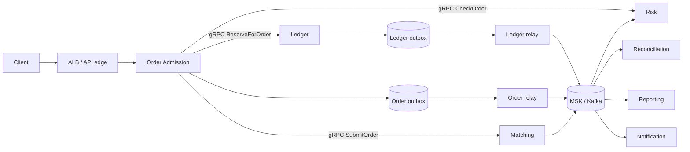

# Praxis microservices migration

## Goal and current state

Move Praxis to independently deployable services without weakening Ledger
invariants or putting asynchronous messaging in calls that need an immediate
answer. The current target runs Order Admission, Ledger, and Matching on EKS
with EC2 nodes. Outbox Relay remains on ECS Fargate; Reconciliation, Reporting,
and Notification are planned for ECS Fargate when implemented. The earlier
all-Fargate and ECS EC2 stages below are historical planning context, not the
current Terraform deployment path.

This is an implementation plan, not a claim that every component exists. The
repository currently contains Order, Ledger, a mock Matching Engine, and an
Outbox Relay. Risk is embedded in Order. Risk, Reconciliation, Reporting, and
Notification require extraction or implementation.

## Implementation progress

Phase 1 is being delivered incrementally:

- [x] Existing images run as a non-root user.
- [x] Existing services load runtime configuration from the environment.
- [x] HTTP liveness/readiness endpoints exist for all current services.
- [x] Ledger and Matching expose the standard gRPC health service; Order
      readiness verifies both dependencies.
- [x] HTTP and gRPC shutdown are bounded and respond to `SIGTERM`.
- [x] Existing processes emit structured JSON logs.
- [x] Propagate request, correlation, and W3C trace context through the current
      HTTP, gRPC, outbox, and Kafka path.
- [x] Add local OpenTelemetry SDK instrumentation, Collector export, Tempo
      storage, and Grafana trace exploration for the current services.
- [ ] Harden the telemetry pipeline for production (authentication, sampling,
      retention, resource metadata, alarms, and a managed or durable backend).
  - [x] Add opt-in ECS tracing to managed X-Ray using a loopback-only ADOT
        sidecar, task-role authentication, sampling, ECS resource metadata,
        retained logs, and export-failure alarms for the Outbox Relay.
  - [x] Configure a shared EKS ADOT Collector to scrape Order, Ledger, and
        Matching `/metrics` pods into AMP and export their OTLP traces to X-Ray.
        Live ingestion has not been verified in AWS.
  - [ ] Deploy a pinned collector image and verify real trace delivery in AWS.
  - [x] Add optional ECS Outbox task-local `/metrics` scraping and SigV4
        remote write to the shared, retained AMP workspace.
  - [x] Add RED latency histograms, a service dashboard artifact, and AMP
        alert rules for current services.
  - [ ] Deploy and verify metric ingestion, import the dashboard into a
        production Grafana workspace, and choose an alert delivery mechanism.
        The `infra/grafana` stack now defines the AMP data source, dashboard,
        equivalent Grafana-managed rules, and email delivery; its read-only
        ingestion check and live dashboard/email verification remain to be run.
        The `infra/aws` stack also defines the Managed Grafana workspace and
        its AMP query role; neither stack has been applied to AWS.
- [ ] Provision compute, ingress, IAM, secrets, and autoscaling for every
      planned service.
  - [x] Provision immutable, scan-on-push ECR repositories with retention
        policies for the current service images.
  - [x] Provision the ECS cluster, Fargate capacity providers, shared task
        execution role, enhanced Container Insights, and service log groups.
  - [x] Provision EKS on EC2 with Pod Identity for Ledger and Matching and
        private Kubernetes Services for the current hot-path workloads.
  - [ ] Add authenticated Order ingress and validated Kubernetes scaling.
- [x] Add a one-off Ledger EKS migration Job and Outbox ECS migration task,
      runtime schema verification, serialized migration execution, and separate runtime
      database credentials. AWS deployment and production verification remain
      operator steps.
- [ ] Implement Risk and Notification (Implement this later).
- [ ] Implement Reporting and Reconciliation (Implement this later).
## Design rules

1. One service owns each write model; services never write each other's tables.
2. Ledger alone owns balances, holds, journals, and entries.
3. Calls that determine the current HTTP response are synchronous and have
   deadlines. Kafka carries asynchronous facts, commands, and projections.
4. Every command/event has an ID, schema version, timestamp, correlation ID,
   causation ID, and deliberate partition key.
5. Consumers are idempotent because Kafka delivery is at least once.
6. A database change and its event use a transactional outbox.
7. Schema and event changes remain compatible during rolling deployments.
8. Infrastructure enters through configuration and workload identity, keeping
   business code portable between ECS and Kubernetes.

## Service boundaries

| Service | Responsibility | Owned state | Interfaces |
|---|---|---|---|
| Order Admission | Validate and orchestrate an order; return its admission result | Orders and idempotency keys | Public HTTP; private gRPC to Risk, Ledger, Matching; order events |
| Risk | Deterministic limit and policy decision | Rules, limits, decision audit | Private gRPC; consumes account/order facts; risk events |
| Ledger | Double-entry accounting, balances, reservations | Ledger PostgreSQL schema | Private gRPC; ledger events through its outbox |
| Matching | Sequence and match orders by market | Order books and recovery/checkpoint state | Private gRPC; ordered matching events |
| Outbox Relay | Reliably publish committed outbox rows | Leases/checkpoints only | Database outbox to Kafka |
| Reconciliation | Find discrepancies and coordinate controlled repair | Runs, findings, repair workflow | Consumes events; produces findings/approved commands |
| Reporting | Build query-optimized, eventually consistent views | Reporting projections | Consumes events; read-only APIs/exports |
| Notification | Apply preferences and deliver messages | Preferences, attempts, dedupe keys | Consumes events/commands; calls delivery providers |

Pair a relay deployment and narrowly scoped credential with each owning
database. Do not create one privileged relay that can read every database.

## Runtime flow

Admission should proceed as follows:

1. Authenticate at the edge and propagate a request/correlation ID.
2. Validate the request and claim the idempotency key in Order.
3. Ask Risk for allow/deny and its policy version under a short deadline.
4. Ask Ledger to atomically reserve funds and record an outbox event.
5. Ask Matching to accept and sequence the order for its market.
6. Persist the Order result/outbox record and return `202 Accepted`.
7. Relays publish committed facts; consumers process them independently.
8. If Matching fails after reservation, issue an idempotent release.
   Reconciliation detects reservations left in an uncertain state.

Never keep a database transaction open across these calls. This is a saga, not
a distributed ACID transaction: each step commits locally and has an
idempotent compensating action.

## Kafka contract

| Topic | Key | Producer | Main consumers |
|---|---|---|---|
| `order.events.v1` | `order_id` | Order relay | Reporting, Notification, Reconciliation |
| `risk.events.v1` | `user_id` | Risk relay | Reporting, Reconciliation |
| `ledger.commands.v1` | `account_id` | Approved workflows | Ledger command consumer |
| `ledger.events.v1` | `account_id` | Ledger relay | Risk, Reporting, Reconciliation, Notification |
| `matching.events.v1` | `market_id` | Matching | Reporting, Reconciliation, Order projection |
| `notification.commands.v1` | `user_id` | Notification policy | Notification |
| `*.dlq.v1` | original key | Consumer error handler | Operations/replay tooling |

Use registry-controlled Protobuf schemas. Never reuse a field number or change
an existing field's meaning. A common envelope should carry `event_id`,
`event_type`, `schema_version`, `occurred_at`, `correlation_id`, `causation_id`,
`producer`, and the typed payload.

Consumer processing pattern:

1. Read a record.
2. In one local transaction, insert `event_id` into an inbox and apply the
   projection/business change.
3. Treat a duplicate inbox key as successful processing.
4. Commit the Kafka offset only after the database commit.
5. Retry transient failures with bounded backoff; quarantine poison records
   with original topic, partition, offset, payload reference, and error.

Partitioning affects correctness. Events for an account use `account_id`;
matching events use `market_id`. Ordering is guaranteed only inside one topic
partition, not globally.

## Phase 1: ECS Fargate

Run each long-running process as its own ECS service in private subnets across
three Availability Zones. Use capacity providers in deployment automation.

| Workload | Exposure | Scale on | Initial minimum |
|---|---|---|---:|
| Order Admission | Public ALB target | request rate, CPU, p95 latency | 3 |
| Risk | Private discovery | request rate, CPU, p95 latency | 3 |
| Ledger | Private discovery | request rate, DB pool saturation | 3 |
| Matching | Private discovery | per-market queue depth, CPU | partition owners plus failover |
| Outbox Relay | None | oldest unpublished-row age | 2 with safe leasing |
| Reconciliation | None | Kafka lag/run duration | 1+ |
| Reporting | Internal only | lag, CPU, request rate | 2 |
| Notification | None | lag, provider latency | 2 |

Add to the existing VPC/MSK/RDS Terraform:

- ECR repositories with immutable tags and image scanning.
- An ECS cluster with `FARGATE` and, only for interruption-safe consumers,
  `FARGATE_SPOT` capacity.
- Cloud Map or Service Connect private discovery.
- A public ALB only for Order Admission; tasks receive no public IP.
- Security groups for edge, synchronous services, Kafka, and databases.
- One task role per service. Kafka topic/group and Secrets Manager permissions
  belong to task roles, not the shared image-pull execution role.
- Secrets Manager injection, CloudWatch logs/alarms, Container Insights, and
  OpenTelemetry export.
- Deployment circuit breakers, multi-AZ placement, graceful stop timeouts, and
  health-aware rolling deployments.

The current Terraform stacks and file groups are mapped in
[`infra/README.md`](../infra/README.md). This phase's earlier proposed
`service-discovery.tf`, `load-balancing.tf`, and service-specific ECS files
were not adopted for the EKS hot path; `infra/aws` remains one root module.

Each process must first have a non-root image, `/healthz`, dependency-aware
`/readyz`, graceful `SIGTERM`, explicit resource/connection/time limits,
structured correlation-aware logs, metrics, and trace propagation over HTTP,
gRPC, and Kafka headers.

## Phase 2: hybrid ECS capacity

Measure Fargate before deciding it is inadequate. Then create an EC2 Auto
Scaling group capacity provider and move Order, Ledger, and Matching in that
order, validating each move independently.

| Workload class | Target | Rationale |
|---|---|---|
| Order Admission, Ledger, Matching | ECS on EC2, one at a time | Measure latency and cost while preserving rollback to Fargate |
| Risk | Fargate until measurements justify a move | Its decision path is synchronous, but extraction is deferred |
| Relay, Reconciliation, Reporting, Notification | Fargate; Spot only where interruption-safe | Bursty/asynchronous work recovers from replacement |

Spread EC2 capacity and tasks across zones, enable managed draining, and keep
replacement headroom. Matching needs lease/coordinator-based partition
ownership with fencing tokens so two tasks cannot own one market after a
network partition.

## Kubernetes portability

| Concern | ECS | Kubernetes |
|---|---|---|
| Long-running workload | ECS Service | Deployment |
| Migration/batch | Standalone task | Job |
| Scheduled reconciliation/report | EventBridge scheduled task | CronJob |
| Discovery | Cloud Map/Service Connect | Service and DNS |
| Configuration | Task environment | ConfigMap |
| Secrets | Secrets Manager injection | External Secrets/CSI plus AWS secret store |
| Identity | Task role | ServiceAccount workload identity |
| Autoscaling | ECS Service Auto Scaling | HPA/KEDA |
| Maintenance availability | healthy-percent/AZ spread | rolling strategy/topology spread/PDB |
| Placement | capacity provider | node pools, labels, taints, affinity |

Use an EC2-backed node pool for Order, Ledger, and Matching. Outbox Relay and
other asynchronous services can remain on ECS Fargate; they share managed RDS
and MSK with Kubernetes workloads through private networking and scoped IAM.
Keep MSK and RDS managed outside Kubernetes.

## Migration order and exit gates

### 0. Baseline

Standardize IDs, event envelopes, health, shutdown, and configuration. Record
latency, throughput, error rates, Kafka lag, DB saturation, and financial
invariants. Add duplicate/replay contract tests.

**Gate:** current behavior and objectives are measurable.

### 1. Extract Risk

Put the existing deterministic risk logic behind an in-process interface, add a
versioned `CheckOrder` gRPC service, deploy it in shadow mode, compare decisions,
then switch Order behind a feature flag. Use a strict timeout and explicit
fail-closed policy before removing the embedded implementation.

**Gate:** independent deployment, zero unexplained shadow mismatches, tested
rollback.

### 2. Make event publication durable

Add transactional outboxes to Order and stateful Risk changes. Harden relay
leasing, retries, schema validation, observability, and shutdown.

**Gate:** killing a process between DB commit and publish loses no event;
redelivery creates no duplicate business effect.

### 3. Add consumers

Build Notification first with an inbox and fake provider. Add rebuildable
Reporting projections. Run Reconciliation in detect-only mode, then require
approval for repair commands before automating proven cases.

**Gate:** projections rebuild, lag is visible, poison records quarantine, and
replay has a runbook.

### 4. Deploy on Fargate

Add ECS/IAM/discovery/ALB/autoscaling/telemetry pipelines. Exercise task death,
broker interruption, DB failover, slow consumers, and provider failure.

**Gate:** a task or AZ loss preserves agreed availability and Ledger invariants.

### 5. Move measured hot paths to EC2

Move Order, Ledger, and Matching in that order; rerun load, failure,
rolling-deployment, cost, and rollback tests after each move.

This earlier ECS EC2 path was superseded by the EKS-on-EC2 deployment. The
legacy Order, Ledger, and Matching ECS service definitions have been removed.
No AWS baseline, traffic cutover, or rollback drill has been completed. The
mock Matching Engine still has no partition fencing or durable recovery.

**Gate:** the move improves a named target and rollback to Fargate works.

### 6. Adopt Kubernetes

Run Order, Ledger, and Matching on Kubernetes EC2 nodes. Validate and hand off
each service deliberately; the earlier ECS EC2 experiments are not a
prerequisite. Keep Outbox Relay and other asynchronous services on ECS
Fargate. Any shadow consumers use separate consumer groups and must suppress
side effects.

The default Terraform path provisions an EKS control plane, EC2 node group,
and Pod Identity roles; Order, Ledger, and Matching have no ECS services.
Their private Kubernetes workloads are managed by the separate `infra/k8s`
Terraform stack. No cluster has been applied or verified in AWS. Order has no
public Kubernetes ingress; the mock Matching Engine still cannot recover its
order book. The deployment runbook is in `infra/k8s/README.md`.

**Gate:** behavior, load, failure, security, cost, and rollback criteria pass.

## Production checklist

- [ ] ADRs for synchronous calls, partition keys, failure policy, and ownership
  - [x] ADR 0001 defines synchronous request-path calls versus asynchronous
        Kafka messaging and their failure semantics.
- [ ] Protobuf compatibility checks in CI
  - [x] Local Buf lint and `FILE`-level compatibility policies are configured
        independently for Ledger, Matching, and Order service contracts.
- [ ] Per-service database roles and Kafka IAM policies for every planned service
  - [x] The one-off Outbox migration task provisions restricted Ledger and
        Outbox runtime roles from separate Secrets Manager passwords; current
        ECS Kafka task roles are scoped.
- [ ] Transactional outboxes and idempotent inboxes
  - [x] Ledger writes its outbox in the local transaction, deduplicates Kafka
        commands through an inbox, and has a separate leased Outbox Relay.
- [x] Correlation/trace context across HTTP, gRPC, and Kafka for current services
- [ ] RED metrics, consumer-lag alarms, and per-service dashboards for every
      planned service
  - [x] Current services expose rates, failures, and latency histograms; an AMP
        rule group and an importable RED dashboard are defined.
  - [x] Ledger has a configurable MSK `MaxOffsetLag` alarm for its command
        consumer group and topic.
- [ ] Replay, DLQ, stuck-reservation, broker, and database runbooks
- [ ] Load tests for normal traffic, hot accounts, and partition skew
- [ ] Backup restore and reconciliation proof
- [ ] ECS and Kubernetes rollback drills

### Shadow mode

Shadow mode sends realistic inputs to a candidate implementation while the
existing implementation remains authoritative. Compare decisions and outputs,
but suppress candidate-side writes, external calls, and published events. It is
useful for extracting Risk (compare allow/deny and policy versions), testing a
new Matching algorithm against a separate order book, or rebuilding a
Reporting projection from a separate Kafka consumer group and database. A
Ledger candidate must use isolated data and never post a second real journal.

Shadow mode checks behavioral equivalence, not full-path performance. A
side-effect-free shadow Order cannot reserve funds or submit to Matching, so
it cannot establish whether EC2 improves real admission latency or throughput.
For that decision, compare repeatable full-path load tests in an isolated
environment, then use a controlled traffic shift with rollback. Shadow mode
can be explored later; it is not a prerequisite for the EC2 move.

### Canary rollout

A canary rollout sends a small share of real requests to the candidate service,
then increases that share only while its error rate, latency, availability, and
business outcomes remain acceptable. For an Order move, keep Fargate running
while gradually routing traffic to EC2; return traffic to Fargate if the EC2
path fails its checks. Unlike shadow mode, canary requests execute the full
workflow and have real side effects, so each request must reach only one Order
service. Do not start the ramp until both paths are healthy and rollback has
been tested. Canary routing can be explored later; it is separate from the
current parallel EC2 service provisioning.

## References

- [AWS ECS capacity providers](https://docs.aws.amazon.com/AmazonECS/latest/developerguide/capacity-launch-type-comparison.html)
- [AWS ECS service discovery](https://docs.aws.amazon.com/AmazonECS/latest/developerguide/create-service-discovery.html)
- [AWS MSK IAM access control](https://docs.aws.amazon.com/msk/latest/developerguide/iam-access-control.html)
- [Kubernetes Horizontal Pod Autoscaling](https://kubernetes.io/docs/concepts/workloads/autoscaling/horizontal-pod-autoscale/)
- [Kubernetes disruptions](https://kubernetes.io/docs/concepts/workloads/pods/disruptions/)
