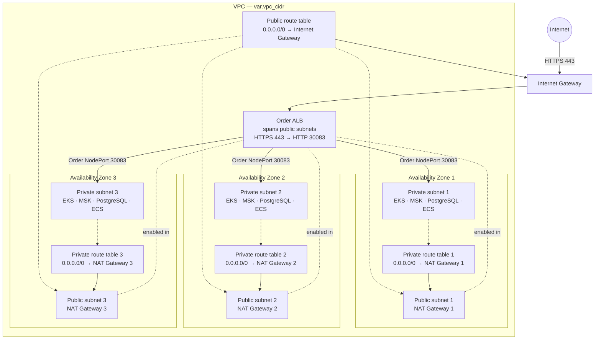
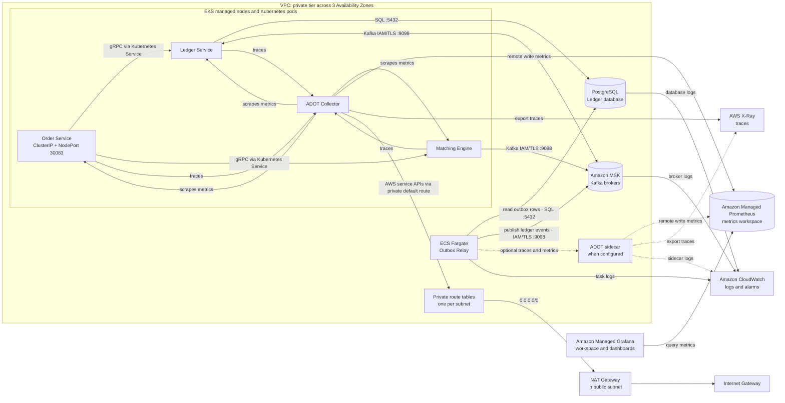

# Infrastructure map

There are three independent Terraform root modules. Apply them in this order:

| Directory | Owns | Reads from |
|---|---|---|
| [`aws/`](aws/README.md) | VPC, MSK, PostgreSQL, ECR, EKS/EC2, ECS/Fargate, IAM, AMP, Managed Grafana workspace | AWS credentials, IAM Identity Center, and `terraform.tfvars` |
| [`k8s/`](k8s/README.md) | EKS namespaces, migration Job, Order/Ledger/Matching Deployments, shared Collector | Outputs from `aws/` and the private EKS API |
| [`grafana/`](grafana/README.md) | AMP data source, RED dashboard, email alert rules | AWS stack outputs, Grafana API token, alert addresses |

Each directory has its own provider configuration and Terraform state. Do not
run Terraform from `infra/` itself. The `.tf` files within a root module are
loaded together; filename order does **not** control creation or apply order.
Resource references and `depends_on` express dependencies.

Start with the README in the relevant directory for prerequisites and apply
commands. `aws/` provisions cloud resources, `k8s/` configures workloads on
the provisioned EKS cluster, and `grafana/` configures the Grafana workspace
created by `aws/`.

## VPC network

The AWS stack creates one public and one private subnet in each of three
Availability Zones. The internet-facing Order ALB uses all three public
subnets and forwards HTTPS requests to the Order NodePort on private EKS
nodes. Each private subnet has its own route table for outbound traffic.

The ALB path is inbound. NAT gateways serve outbound connections initiated
from private subnets. With `nat_gateway_per_az = false`, all private route
tables point to the NAT gateway in public subnet 1.
The dotted lines from the ALB show its placement; its solid arrows show request
flow. AWS manages ALB nodes in the public subnets; the ALB forwards requests
to Order targets on private EKS nodes.

## Private tier

The application workloads share the three private subnets. This diagram shows
their main connections; a service drawn once may have resources in more than
one Availability Zone.

Traffic among workloads, MSK, and PostgreSQL uses the VPC's local route.
The private route tables and NAT gateways handle outbound traffic to
destinations outside the VPC. Grafana queries metrics from AMP; the collectors
send traces to X-Ray. CloudWatch receives the configured ECS, MSK, and
PostgreSQL logs and hosts infrastructure alarms. The Outbox ADOT sidecar is
created only when its image is configured.
