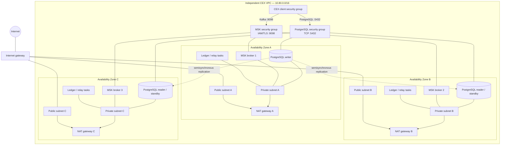

# CEX AWS infrastructure

This Terraform stack provisions a production-oriented, provisioned Amazon MSK
cluster, its Kafka topics, and a PostgreSQL Multi-AZ DB cluster for the ledger.

This stack is self-contained. It does not read or reuse an external VPC,
subnet, route, or security-group resources.

It creates:

- A dedicated CEX VPC spanning three Availability Zones
- Public and private subnets, an internet gateway, NAT gateways, and routes
- Dedicated CEX application-client and MSK security groups
- A three-broker MSK cluster in the new CEX private subnets
- A PostgreSQL Multi-AZ DB cluster with one writer and two readable standbys
- Immutable, scan-on-push ECR repositories for each current service
- An ECS cluster with Fargate and opt-in Fargate Spot capacity
- A shared task execution role and per-service CloudWatch log groups
- RDS-managed database credentials stored in Secrets Manager
- IAM authentication and TLS-only client connections
- Separate KMS encryption keys for MSK and PostgreSQL
- CloudWatch broker logs and Prometheus broker exporters
- A broker security group allowing port `9098` from approved client security groups
- `matching.events.v1`, `ledger.commands.v1`, `ledger.events.v1`, and `ledger.events.dlq.v1`

## Deploy

Terraform and its AWS credentials need permission to manage MSK, topic API,
RDS, Secrets Manager, EC2 networking and security groups, KMS, and CloudWatch
Logs resources.

```bash
cp terraform.tfvars.example terraform.tfvars
terraform init
terraform plan
terraform apply
```

The default network uses three Availability Zones and one NAT gateway per AZ.
Set `nat_gateway_per_az = false` for a cheaper non-production environment; that
reduces cost but makes outbound private-subnet traffic depend on one AZ. The
broker count must be a multiple of the Availability Zone count. Topic
replication factor `3` requires at least three brokers.

## Network structure



Normal Kafka and PostgreSQL traffic remains inside the VPC. NAT gateways are
only for outbound connections initiated by workloads in private subnets.

## PostgreSQL connections

RDS exposes logical cluster endpoints rather than requiring applications to
track individual database instances:

```text
ledger_writer_endpoint ──► current writer
ledger_reader_endpoint ──► reader B or reader C, selected per connection
```

Use the writer endpoint for ledger posting, balance reservation, migrations,
and the outbox relay. Use the reader endpoint only for replica-lag-tolerant
reporting and historical queries. Credentials are generated by RDS; retrieve
them using the `ledger_master_secret_arn` output rather than putting a password
in `terraform.tfvars` or Terraform state.

Automatic Kafka topic creation is disabled. Add or change topics through the
`topics` variable so partition counts, replication, retention, and durability
settings remain version controlled.

The applications should use the `bootstrap_brokers_sasl_iam` output. ECS
services should run in the `private_subnet_ids` output and attach the
`cex_client_security_group_id` output. Their IAM roles must separately receive
the required `kafka-cluster:Connect`, read, write, and consumer-group
permissions.

## Container repositories

Terraform creates separate repositories for Order, Ledger, Matching, and the
Outbox Relay. Repository names include the application and environment, image
tags are immutable, and every push is scanned. Lifecycle policies delete
untagged images after seven days and retain the newest 50 tagged images by
default; both limits are configurable.

After applying the stack, retrieve image destinations with:

```bash
terraform output -json ecr_repository_urls
```

Build pipelines should publish a unique tag such as the Git commit SHA. ECS
task definitions should deploy the resolved image digest rather than a mutable
tag so a rollback always selects the same artifact.

## ECS cluster foundation

The ECS cluster enables enhanced Container Insights and registers both
`FARGATE` and `FARGATE_SPOT`. Its default strategy uses only `FARGATE`, so a
service cannot land on Spot accidentally. A later service definition may opt
an interruption-safe consumer into `FARGATE_SPOT` explicitly.

The shared task execution role has AWS's managed execution policy for ECR image
pulls and CloudWatch log delivery. It is deliberately separate from application
task roles: Ledger, Matching, Order, and relays will receive narrowly scoped
roles for their own Kafka, database-authentication, secret, and other runtime
permissions. Terraform also creates a retained CloudWatch application log group
for every current service.
