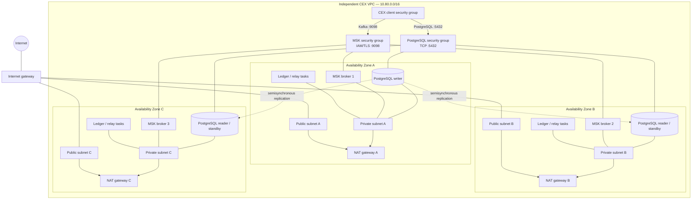

# CEX AWS infrastructure

This Terraform stack provisions a production-oriented, provisioned Amazon MSK
cluster, its Kafka topics, and a PostgreSQL Multi-AZ DB cluster for the ledger.

This stack is self-contained. It does not read or reuse an external VPC,
subnet, route, or security-group resources.

It creates:

- A dedicated CEX VPC spanning three Availability Zones
- Public and private subnets, an internet gateway, NAT gateways, and routes
- Dedicated CEX application-client and MSK security groups
- A three-broker MSK cluster in the new CEX private subnets
- A PostgreSQL Multi-AZ DB cluster with one writer and two readable standbys
- Immutable, scan-on-push ECR repositories for each current service
- An ECS cluster with Fargate and opt-in Fargate Spot capacity
- A shared task execution role and per-service CloudWatch log groups
- A distinct IAM task role for each current application service
- An optional HTTPS-only Order ALB foundation, disabled by default
- A private Cloud Map namespace with Ledger and Matching gRPC service records
- An opt-in, private, single-replica Matching Engine ECS service
- An opt-in, private, single-replica Ledger ECS service
- An opt-in, private, single-replica Outbox Relay ECS service
- RDS-managed database credentials stored in Secrets Manager
- IAM authentication and TLS-only client connections
- Separate KMS encryption keys for MSK and PostgreSQL
- CloudWatch broker logs and Prometheus broker exporters
- A broker security group allowing port `9098` from approved client security groups
- `matching.events.v1`, `ledger.commands.v1`, `ledger.events.v1`, and `ledger.events.dlq.v1`

## Deploy

Terraform and its AWS credentials need permission to manage MSK, topic API,
RDS, Secrets Manager, EC2 networking and security groups, KMS, and CloudWatch
Logs resources.

```bash
cp terraform.tfvars.example terraform.tfvars
terraform init
terraform plan
terraform apply
```

The default network uses three Availability Zones and one NAT gateway per AZ.
Set `nat_gateway_per_az = false` for a cheaper non-production environment; that
reduces cost but makes outbound private-subnet traffic depend on one AZ. The
broker count must be a multiple of the Availability Zone count. Topic
replication factor `3` requires at least three brokers.

## Network structure



Normal Kafka and PostgreSQL traffic remains inside the VPC. NAT gateways are
only for outbound connections initiated by workloads in private subnets.

## PostgreSQL connections

RDS exposes logical cluster endpoints rather than requiring applications to
track individual database instances:

```text
ledger_writer_endpoint ──► current writer
ledger_reader_endpoint ──► reader B or reader C, selected per connection
```

Use the writer endpoint for ledger posting, balance reservation, migrations,
and the outbox relay. Use the reader endpoint only for replica-lag-tolerant
reporting and historical queries. Credentials are generated by RDS; retrieve
them using the `ledger_master_secret_arn` output rather than putting a password
in `terraform.tfvars` or Terraform state.

Automatic Kafka topic creation is disabled. Add or change topics through the
`topics` variable so partition counts, replication, retention, and durability
settings remain version controlled.

The applications should use the `bootstrap_brokers_sasl_iam` output. ECS
services should run in the `private_subnet_ids` output and attach the
`cex_client_security_group_id` output. Their IAM roles must separately receive
the required `kafka-cluster:Connect`, read, write, and consumer-group
permissions.

## Container repositories

Terraform creates separate repositories for Order, Ledger, Matching, and the
Outbox Relay. Repository names include the application and environment, image
tags are immutable, and every push is scanned. Lifecycle policies delete
untagged images after seven days and retain the newest 50 tagged images by
default; both limits are configurable.

After applying the stack, retrieve image destinations with:

```bash
terraform output -json ecr_repository_urls
```

Build pipelines should publish a unique tag such as the Git commit SHA. ECS
task definitions should deploy the resolved image digest rather than a mutable
tag so a rollback always selects the same artifact.

## ECS cluster foundation

The ECS cluster enables enhanced Container Insights and registers both
`FARGATE` and `FARGATE_SPOT`. Its default strategy uses only `FARGATE`, so a
service cannot land on Spot accidentally. A later service definition may opt
an interruption-safe consumer into `FARGATE_SPOT` explicitly.

The shared task execution role has AWS's managed execution policy for ECR image
pulls and CloudWatch log delivery. Ledger uses a dedicated execution role so
its database secret permission is not shared. Execution roles are deliberately
separate from application task roles: Ledger, Matching, Order, and relays
receive narrowly scoped roles for their own Kafka, database-authentication,
secret, and other runtime
permissions. Terraform also creates a retained CloudWatch application log group
for every current service.

## Private gRPC discovery

Cloud Map provides private `A` records for Ledger and Matching inside the CEX
VPC. Retrieve the intended Order Service targets with:

```bash
terraform output -json grpc_service_addresses
```

The targets use the existing Ledger port `9091` and Matching port `9092`.
The records have a 10-second TTL and ECS-managed custom health status. Creating
the namespace and services alone does **not** register task IPs: the later ECS
service definitions must attach the corresponding
`grpc_service_discovery_arns` as service registries. Their task security groups
must also allow Order-to-Ledger and Order-to-Matching gRPC traffic.

## First ECS service: mock Matching Engine

Matching is the first ECS workload because it does not need a database secret.
It is **not** a production matching engine: partition sequence and request
deduplication live only in memory. The ECS service is absent by default. After
building and pushing an image to the Matching ECR repository, set
`matching_image_digest` to its `sha256:...` digest to create the task definition
and one private Fargate task. The task runs without a public IP, exports JSON
logs to its CloudWatch log group, authenticates to MSK with IAM/TLS, and
registers its private IP in Cloud Map.

The task's health command calls its local `/readyz` endpoint without requiring
a shell or `curl` in the non-root distroless image. ECS uses a stop-before-start
deployment (`minimum_healthy_percent = 0`, `maximum_percent = 100`) so a
replacement cannot overlap this mock's in-memory partition ownership; expect
brief unavailability during deployments. Do not scale it above one task until
partition leasing, fencing, and recovery are implemented. Order tasks must
later attach `order_grpc_client_security_group_id` to call its private gRPC
port `9092`; the Matching task group permits that source only. The existing
CEX client group supplies the task's outbound MSK access.

## Ledger ECS service

Ledger is also disabled by default. Build and push the Ledger image, then set
`ledger_image_digest` to its `sha256:...` digest to create one private Fargate
task. It registers its gRPC port `9091` in Cloud Map, consumes
`ledger.commands.v1` through MSK IAM/TLS, and uses `/readyz` for container
health checks. Only tasks with `order_grpc_client_security_group_id` can call
its gRPC port; there is no public Ledger listener.

The task reads the RDS-managed secret's `password` JSON key through a dedicated
Ledger execution role; the shared execution role cannot read that secret. Its
database host, name, and username come from Terraform;
the password itself is not put in Terraform state. ECS injects the password at
task startup, so a secret rotation requires a new deployment. This first
single-task rollout uses the RDS *admin* account because the stack does not
yet provision a dedicated Ledger database role. Give Ledger a least-privilege
database user and separate migration ownership before production use. Its
stop-before-start deployment can briefly interrupt Ledger requests.

## Outbox Relay ECS service

Set `outbox_image_digest` to a pushed image digest to create one private
Fargate relay task. The task has no public endpoint or inbound security-group
rule. It connects to the Ledger writer database and MSK with IAM/TLS, maps
stored `ledger-events` to `ledger.events.v1`, and reports health through its
local `/readyz` endpoint. Its hostname supplies a distinct lease owner ID.

The relay has its own execution role for the RDS-managed password and its own
task role restricted to the Ledger event topic. This initial rollout uses the
RDS admin account and runs migrations at startup; provision a dedicated
least-privilege database user and separate migration ownership before
production use. The service starts at one task and uses Fargate rather than
Spot. A secret rotation requires a new deployment to refresh the injected
password.

## Application task roles

Terraform creates a separate task role for Order, Ledger, Matching, and Outbox
Relay. Use the `service_task_role_arns` output as the corresponding ECS task
definition's `task_role_arn`; do not substitute the shared execution role. Each
trust policy permits ECS tasks from this account and Region to assume the role.
AWS does not support narrowing the trust policy to one ECS cluster ARN.

The Ledger, Matching, and Outbox Relay roles receive separate MSK policies.
Ledger can read only `ledger.commands.v1` as the configured consumer group;
Matching can write only `matching.events.v1`; the relay can write only
`ledger.events.v1`. Order receives no MSK grant. These roles still need other
runtime permissions, including database access, before ECS deployment.

## Kafka client authentication

Ledger, Matching, and Outbox Relay default to `KAFKA_AUTH_MODE=plaintext` for
local Compose. For the IAM-authenticated MSK bootstrap brokers, set
`KAFKA_AUTH_MODE=msk_iam`, `AWS_REGION` to the cluster Region, and each
service's `*_KAFKA_BROKERS` variable to `bootstrap_brokers_sasl_iam`. The IAM
mode uses TLS certificate verification and obtains a fresh SASL/OAUTHBEARER
token from the ECS task role for each new broker connection. It fails startup
configuration validation if `AWS_REGION` is missing. Do not use the plaintext
mode against the IAM-only MSK cluster.

For the current Ledger schema, set
`OUTBOX_KAFKA_TOPIC_MAP=ledger-events=ledger.events.v1` on its dedicated relay.
This changes the Kafka destination during publication without rewriting
committed outbox rows, preserving local Compose behavior and retry semantics.
Set `LEDGER_COMMANDS_TOPIC=ledger.commands.v1` on Ledger; its local default is
still `ledger-commands`. Set `LEDGER_CONSUMER_GROUP` to the Terraform
`ledger_consumer_group` value (default `cex-ledger-service`). The relay must
only read the owning Ledger database; do not reuse its credential or topic map
for another service's outbox.

## Order ALB foundation

The public Order ALB is off by default. To create it, set
`order_alb_enabled = true` and provide an ACM certificate ARN in the same AWS
Region through `order_alb_certificate_arn`. There is no public HTTP listener.
The HTTPS listener deliberately returns `503` rather than forwarding requests:
the current Order API does not yet authenticate clients at the edge.

Terraform also creates an `ip` target group on port `8083` with `/readyz`
health checks, plus security groups that permit only ALB-to-Order HTTP traffic.
The future Order ECS service must attach `order_target_group_arn` and
`order_task_security_group_id`. Before changing the listener to forward traffic,
implement edge authentication, configure the Order service, and verify the
health checks and load-test behavior. The task group has no outbound rules of
its own; attach only the additional narrowly scoped groups needed for its
private dependencies.
